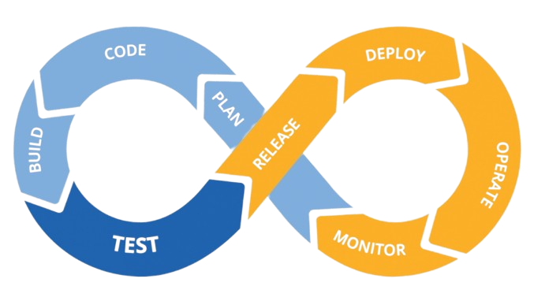

<a name="readme-top"></a>

<div align="center">
	<code></code>
	<code></code>
	<code></code>
  <code></code>
  <code></code>
	<code></code>
	<code></code>
  <code></code>
  <code></code>
	<code></code>
	<code></code>
  <code></code>
	<code></code>
</div>


<br />
<div align="center">
    
  <h3 align="center">DevOps Project</h3>

  <p align="center">
    Implement CI/CD in VPC
    <br />
    <a href="https://github.com/othneildrew/Best-README-Template"><strong>Explore the docs »</strong></a>
  </p>
</div>


<details>
  <summary>Table of Contents</summary>
  <ol>
    <li>
      <a href="#about-the-project">About The Project</a>
    </li>
    <li>
      <a href="#getting-started">Getting Started</a>
      <ul>
        <li><a href="#prerequisites">Prerequisites</a></li>
        <li><a href="#installation">Installation</a></li>
        <li><a href="#jenkins">Jenkins</a></li>
      </ul>
    </li>
    <li><a href="#usage">Usage</a></li>
    <li><a href="#contributing">Contributing</a></li>
    <li><a href="#license">License</a></li>
    <li><a href="#contact">Contact</a></li>
    <li><a href="#acknowledgments">Acknowledgments</a></li>
  </ol>
</details>


## About The Project


There are many great README templates available on GitHub; however, I didn't find one that really suited my needs so I created this enhanced one. I want to create a README template so amazing that it'll be the last one you ever need -- I think this is it.

Here's why:
* Your time should be focused on creating something amazing. A project that solves a problem and helps others
* You shouldn't be doing the same tasks over and over like creating a README from scratch
* You should implement DRY principles to the rest of your life :smile:

Of course, no one template will serve all projects since your needs may be different. So I'll be adding more in the near future. You may also suggest changes by forking this repo and creating a pull request or opening an issue. Thanks to all the people have contributed to expanding this template!

Use the `BLANK_README.md` to get started.

<p align="right">(<a href="#readme-top">back to top</a>)</p>


## Getting Started

This is an example of how you may give instructions on setting up your project locally.
To get a local copy up and running follow these simple example steps.

### Prerequisites

This is an example of how to list things you need to use the software and how to install them.
* Terraform and AWS Free Tire Account
* GitHub repository with your application 

### Installation

_Below is an example of how you can instruct your audience on installing and setting up your app. This template doesn't rely on any external dependencies or services._

1. Get a free API Key at [https://example.com](https://example.com)
2. Clone the repo
   ```sh
   git clone https://github.com/your_username_/Project-Name.git
   ```
3. Install NPM packages
   ```sh
   npm install
   ```
4. Enter your API in `config.js`
   ```js
   const API_KEY = 'ENTER YOUR API';
   ```

### Jenkins

_Below is how to configure the Jenkins Pipeline to build a Node.js application, create a Docker Image from it, and upload it to Docker Hub._

1. Add the following piece of code to `/etc/sudoers`
   ```sh
   jenkins ALL=(ALL) NOPASSWD: ALL
   ```
2. Generate an ssh key and use a private key when creating a pipeline in Jenkins.
   ```sh
   ssh-keygen
   ```
3. Complete the basic Jenkins setup and install the suggested plugins. Then create a pipeline. The pipeline will do the following:
   
   * Take code from a GitHub repository with a Node.js application
   * Test and build this application
   * Build a Docker Image and upload it to Docker Hub
4. Configure GitHub Webhook to automatically run Jenkins job 
5. The steps for creating a pipeline are described below.
   
   * On the Jenkins dashboard, select new item and choose pipeline
   * Select the GitHub Project checkbox and paste the Node.js project url
   * In the build triggers, select GitHub hook trigger for GITScm polling
   * In the pipeline section, select pipeline script from SCM, select Git as SCM, insert the repository url and private key that you created earlier 
   * Optionally, you can change the branch
   * Apply and Save
6. Now when you commit and push to a GitHub repository, a job will be launched immediately.

<p align="right">(<a href="#readme-top">back to top</a>)</p>


## Usage

Use this space to show useful examples of how a project can be used. Additional screenshots, code examples and demos work well in this space. You may also link to more resources.

_For more examples, please refer to the [Documentation](https://example.com)_

<p align="right">(<a href="#readme-top">back to top</a>)</p>


## Contributing

Contributions are what make the open source community such an amazing place to learn, inspire, and create. Any contributions you make are **greatly appreciated**.

If you have a suggestion that would make this better, please fork the repo and create a pull request. You can also simply open an issue with the tag "enhancement".
Don't forget to give the project a star! Thanks again!

1. Fork the Project
2. Create your Feature Branch (`git checkout -b feature/AmazingFeature`)
3. Commit your Changes (`git commit -m 'Add some AmazingFeature'`)
4. Push to the Branch (`git push origin feature/AmazingFeature`)
5. Open a Pull Request

<p align="right">(<a href="#readme-top">back to top</a>)</p>


## License

Distributed under the MIT License. See `LICENSE.txt` for more information.

<p align="right">(<a href="#readme-top">back to top</a>)</p>


## Contact

Roman Strypa - [LinkedIn](https://www.linkedin.com/in/roman-strypa-b4623a205/) - romanstripa@gmail.com

Project Link: [https://github.com/your_username/repo_name](https://github.com/your_username/repo_name)

<p align="right">(<a href="#readme-top">back to top</a>)</p>


## Acknowledgments

Use this space to list resources you find helpful and would like to give credit to. I've included a few of my favorites to kick things off!

* [Choose an Open Source License](https://choosealicense.com)
* [GitHub Emoji Cheat Sheet](https://www.webpagefx.com/tools/emoji-cheat-sheet)
* [Malven's Flexbox Cheatsheet](https://flexbox.malven.co/)
* [Malven's Grid Cheatsheet](https://grid.malven.co/)
* [Img Shields](https://shields.io)
* [GitHub Pages](https://pages.github.com)
* [Font Awesome](https://fontawesome.com)
* [React Icons](https://react-icons.github.io/react-icons/search)
* [Badges 4 README.md](https://github.com/alexandresanlim/Badges4-README.md-Profile)

<p align="right">(<a href="#readme-top">back to top</a>)</p>


